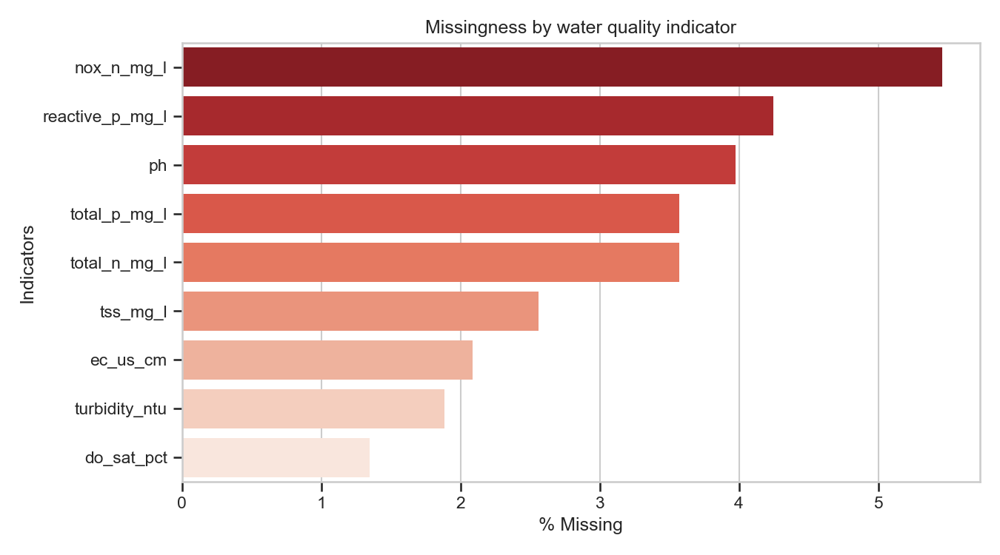
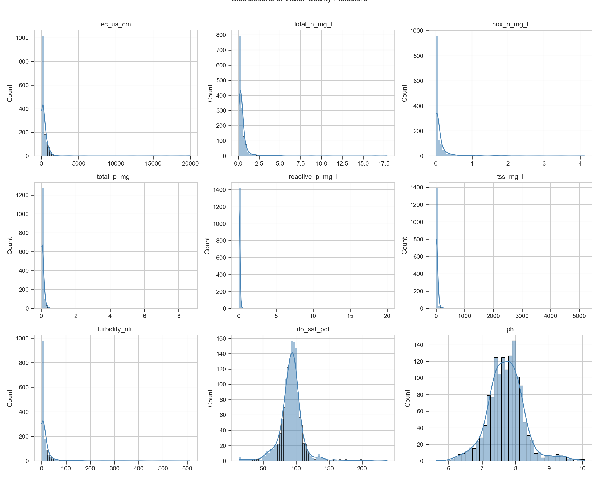
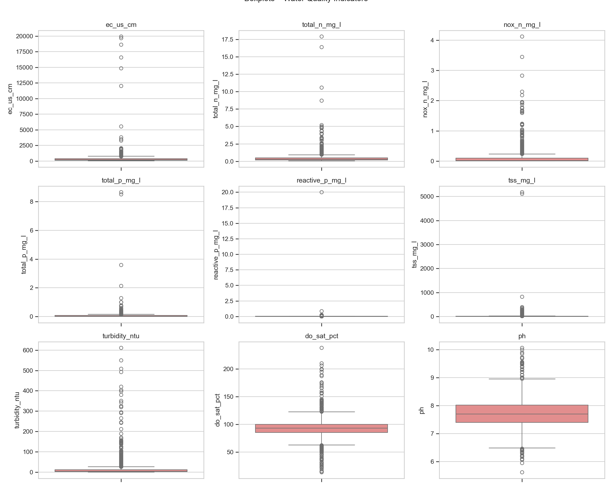
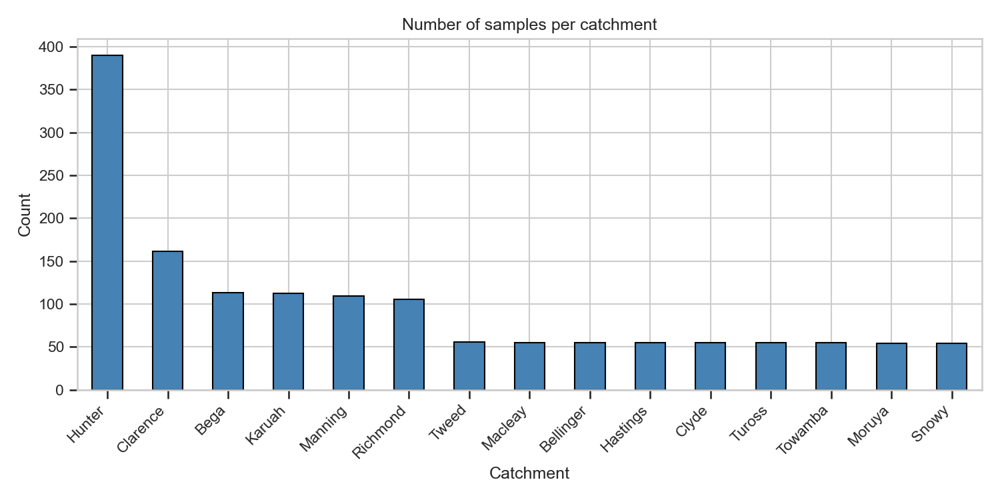
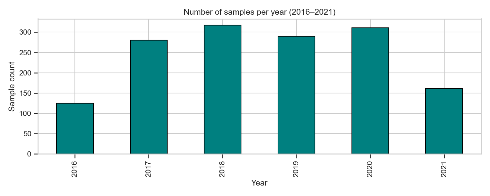
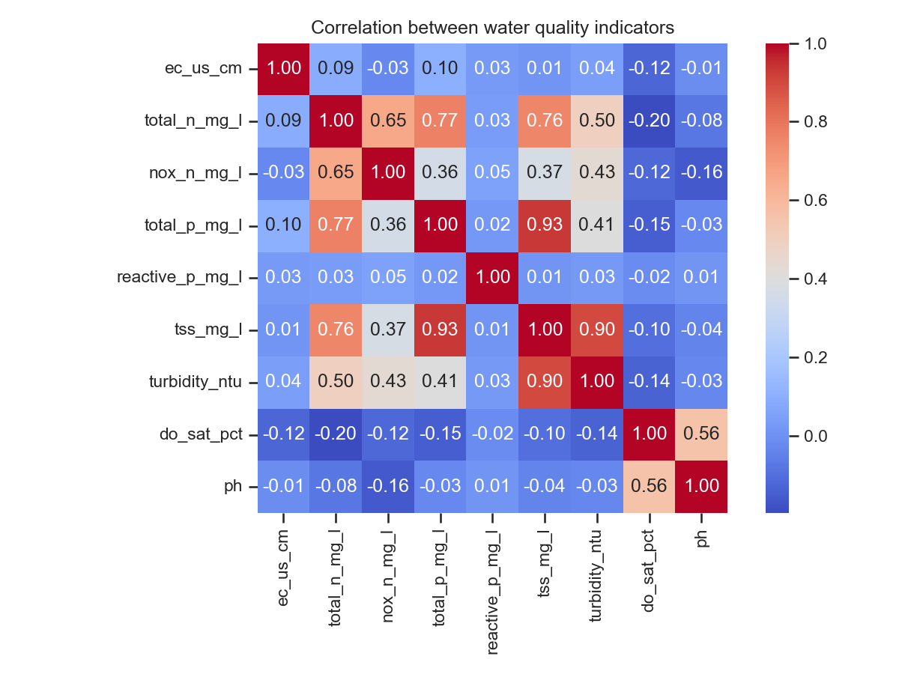
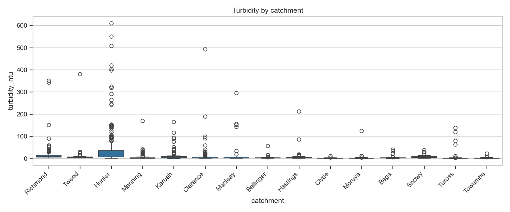
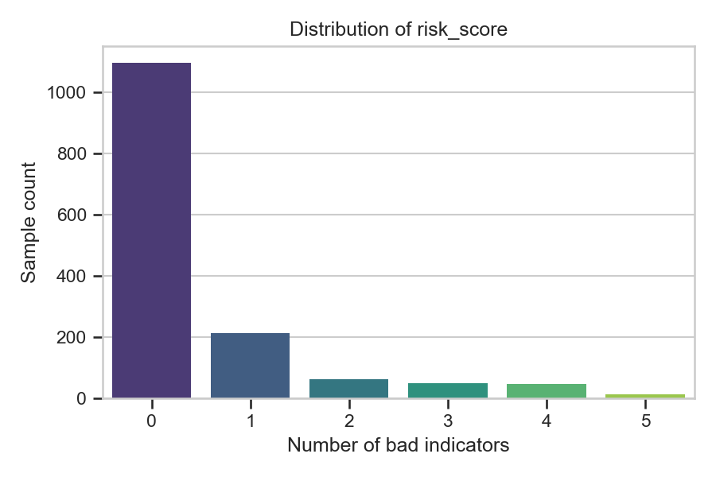
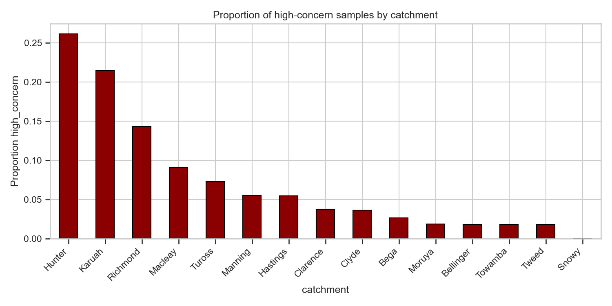
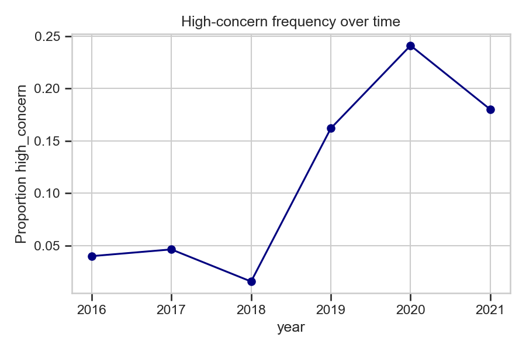

# nsw-water-quality-analysis
Data Science Assignment 2 on NSW coastal water quality analysis
# 🌊 NSW Water Quality Analysis & Prediction

## 📌 Project Overview
This project analyzes and predicts water quality conditions in NSW coastal catchments using machine learning. The goal is to classify water samples as **Normal (0)** or **High Concern (1)** based on environmental indicators such as turbidity, nutrients, dissolved oxygen, and pH, and to predict future water quality conditions.

---

## 📊 Exploratory Data Analysis (EDA)

The dataset was analyzed to understand:
- Missing data patterns
- Distribution of environmental variables
- Outliers and anomalies
- Spatial variation across catchments
- Temporal trends in water quality
- Correlation between indicators
- Risk score behaviour

---

### 📉 Missing Data Analysis

---

### 📊 Feature Distributions

---

### 📦 Outlier Detection (Boxplots)

---

### 🌊 Samples per Catchment

---

### 📅 Samples per Year

---

### 🔗 Correlation Matrix

---

### 🌫️ Turbidity by Catchment

---

### ⚠️ Risk Score Distribution

---

### 🚨 High Concern by Catchment

---

### 📈 High Concern Over Time

---

## 🤖 Machine Learning Models

The following models were trained to predict next-month water quality:

- Logistic Regression
- Decision Tree
- Random Forest
- K-Nearest Neighbours (KNN)

---

## 📊 Model Performance Summary

| Model | Accuracy | Precision | Recall | F1 Score | ROC AUC |
|------|----------|-----------|--------|----------|----------|
| Logistic Regression | 0.767 | 0.277 | 0.621 | 0.383 | 0.814 |
| Decision Tree | 0.823 | 0.358 | 0.655 | 0.463 | 0.759 |
| Random Forest | **0.892** | **0.550** | 0.379 | **0.449** | **0.842** |
| KNN | 0.855 | 0.316 | 0.207 | 0.250 | 0.652 |

---

## 🏆 Key Findings

- Random Forest achieved the best overall performance (highest accuracy and ROC-AUC)
- Decision Tree performed best for detecting high-risk water events (highest recall)
- Logistic Regression provided a strong baseline model
- KNN performed the weakest due to high-dimensional feature space and sensitivity to distance metrics
- Water quality varies significantly across catchments and over time

---

## 📌 Conclusion

Machine learning models can effectively predict water quality risks in NSW catchments. Tree-based ensemble methods, especially Random Forest, are most suitable for this dataset due to their ability to handle nonlinear relationships, mixed data types, and complex environmental interactions.

Future improvements could include advanced time-series models and feature engineering for seasonal and spatial dependencies.
